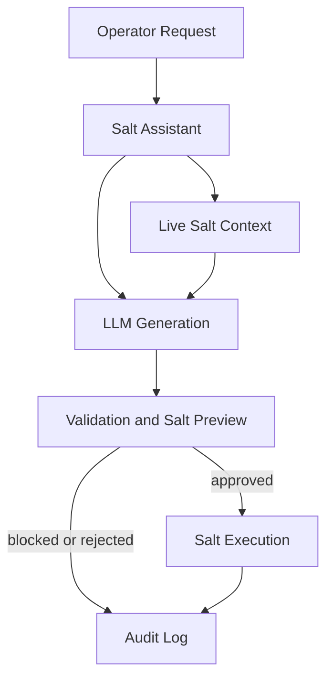

# Salt Assistant

Salt Assistant converts natural-language infrastructure requests into validated SaltStack states. It is an operator-assistance tool: it gathers live Salt context, asks an OpenAI-compatible LLM for structured state data, validates the result, runs Salt test mode, shows the proposed changes, and records an audit event.

## Project Summary

Salt Assistant converts natural-language infrastructure requests into safe, validated SaltStack automation through a command-line interface.

### Five Key Implementations

1. CLI commands with `salt-assistant` and `sa`.
2. Live Salt context and minion discovery.
3. LLM-generated Salt state files.
4. YAML, Jinja, module, and security validation.
5. Salt preview and hash-based human approval before execution.

## Architecture



Salt Assistant combines live infrastructure context with LLM-generated Salt states. Validation, preview, approval, execution, and auditing form the safety boundary.

## Status

Production-oriented preview workflow is implemented. Execution requires `--execute` and an exact generated state-hash confirmation. Secrets are not printed or included in prompts by this application. Automatic rollback, Salt API support, and persistent audit storage are not yet implemented.

## Requirements

- Python 3.10+
- Salt 3008.x with a configured master and accepted minions
- An OpenAI-compatible chat-completions provider
- Writable Salt file root for temporary preview/apply states

## Install

```bash
python -m venv .venv
. .venv/bin/activate
pip install -r requirements.txt
pip install -e .
cp .env.example .env
```

Set real values in `.env`:

```env
OPENAI_BASE_URL=https://api.groq.com/openai/v1
OPENAI_API_KEY=your-key
OPENAI_MODEL=llama-3.3-70b-versatile
SALT_COMMAND=salt
SALT_CONFIG_DIR=/etc/salt
SALT_FILE_ROOT=/srv/salt
```

`OPENAI_BASE_URL`, `OPENAI_API_KEY`, and `OPENAI_MODEL` are required. `SALT_TIMEOUT`, `LLM_TIMEOUT`, `MAX_MINIONS_AFFECTED`, `SALT_STATE_DIR`, and `AUDIT_LOG` are optional. Shell environment variables override `.env`; never commit `.env` or API keys.

## LLM data boundary

The LLM receives only the operator request, resolved minion IDs, and operating-system facts. It does not receive the repository, existing state files, templates, Pillar, Salt keys, logs, API keys, or full grains. The model returns structured Salt source data; deterministic validation and Salt test mode remain authoritative.

## Network automation lab

The repository includes a small YAML inventory and Jinja configuration workflow:

```text
salt/inventory/devices.yml
	|
	v
salt/templates/router_config.jinja
	|
	v
salt/states/network_config.sls
	|
	v
Salt test mode and approval
```

The inventory models device identity, vendor, platform, role, management address, and interfaces. The template renders hostname and interface configuration, while `network_config.sls` applies it with Salt's `file.managed` and `template: jinja`. Rendering uses strict undefined-variable handling, so incomplete device data fails rather than producing partial configuration.

## Usage

The CLI accepts a natural-language request and optional Salt target:

```bash
salt-assistant [OPTIONS] "REQUEST"
sa [OPTIONS] "REQUEST"
```

```bash
# Generate, validate, and preview a state
salt-assistant "install nginx" --target 'web*'

# Save output under salt/states/
salt-assistant "install nginx" --output nginx.sls

# Emit stable machine-readable output
salt-assistant "restart nginx" --json

# Apply only after test mode and hash confirmation
salt-assistant "install nginx" --execute
```

Key options are `--target/-t` for Salt targeting, `--output/-o` for saving SLS, `--dry-run/-n` for preview mode, `--json` for automation, and `--execute/-e` for approved changes. The `sa` command is an alias. Preview is the default; execution requires successful validation, Salt test mode, and exact state-hash confirmation.

## Salt layout

```text
salt/
├── config/       # Workspace master and minion configuration
├── inventory/     # YAML network device inventory
├── states/       # Generated and maintained .sls files
├── templates/    # Jinja template assets
├── pillar/       # Pillar data
└── runtime/      # Local keys, cache, sockets; ignored by Git
logs/             # Audit and Salt logs; ignored by Git
src/salt_assistant/
├── main.py       # CLI and pipeline orchestration
├── llm_client.py # OpenAI-compatible client
├── salt_client.py# Salt target, preview, and apply integration
├── generator.py  # Structured LLM response and SLS rendering
├── validator.py  # YAML, module, and security checks
├── policy.py     # Target safety limits
└── safety.py     # Hashes and audit records
```

For a local workspace Salt stack, use `SALT_CONFIG_DIR=/workspaces/Salt-Assistant/salt/config` and start `salt-master` and `salt-minion` with that configuration. For shared infrastructure, use the system Salt configuration and a privileged, properly managed minion.

## Development

```bash
pytest
python -m compileall -q src tests
```

The test suite uses mocked external services and does not require LLM credentials or a live Salt master.
