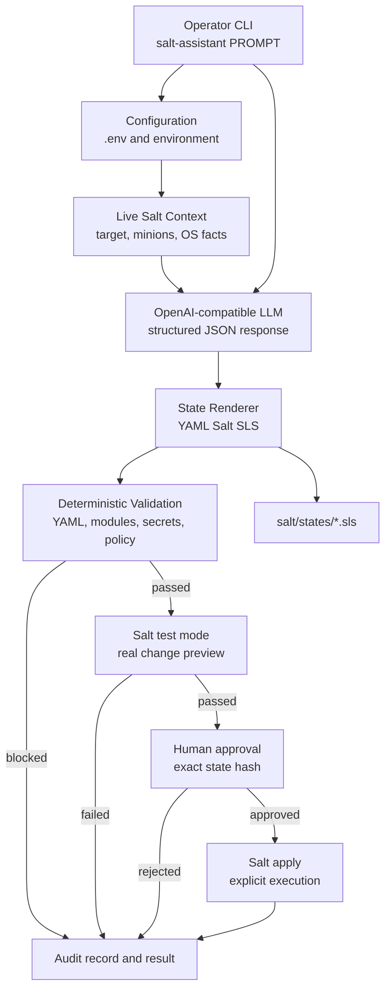

# Salt Assistant

Salt Assistant converts natural-language infrastructure requests into validated SaltStack states. It is an operator-assistance tool: it gathers live Salt context, asks an OpenAI-compatible LLM for structured state data, validates the result, runs Salt test mode, shows the proposed changes, and records an audit event.

## Architecture



The LLM proposes structured state data, but deterministic validation and Salt test mode are authoritative. Execution cannot proceed without a successful preview and hash-bound operator approval.

## Status

Production-oriented preview workflow is implemented. Execution requires `--execute` and an exact generated state-hash confirmation. Secrets are not printed or included in prompts by this application. Automatic rollback, Salt API support, and persistent audit storage are not yet implemented.

## Requirements

- Python 3.10+
- Salt 3008.x with a configured master and accepted minions
- An OpenAI-compatible chat-completions provider
- Writable Salt file root for temporary preview/apply states

## Install

```bash
python -m venv .venv
. .venv/bin/activate
pip install -r requirements.txt
pip install -e .
cp .env.example .env
```

Set real values in `.env`:

```env
OPENAI_BASE_URL=https://api.groq.com/openai/v1
OPENAI_API_KEY=your-key
OPENAI_MODEL=llama-3.3-70b-versatile
SALT_COMMAND=salt
SALT_CONFIG_DIR=/etc/salt
SALT_FILE_ROOT=/srv/salt
```

`OPENAI_BASE_URL`, `OPENAI_API_KEY`, and `OPENAI_MODEL` are required. `SALT_TIMEOUT`, `LLM_TIMEOUT`, `MAX_MINIONS_AFFECTED`, `SALT_STATE_DIR`, and `AUDIT_LOG` are optional. Shell environment variables override `.env`; never commit `.env` or API keys.

## LLM data boundary

The LLM receives only the operator request, resolved minion IDs, and operating-system facts. It does not receive the repository, existing state files, templates, Pillar, Salt keys, logs, API keys, or full grains. The model returns structured Salt source data; deterministic validation and Salt test mode remain authoritative.

## Usage

```bash
# Generate, validate, and preview a state
salt-assistant "install nginx" --target 'web*'

# Save output under salt/states/
salt-assistant "install nginx" --output nginx.sls

# Emit stable machine-readable output
salt-assistant "restart nginx" --json

# Apply only after test mode and hash confirmation
salt-assistant "install nginx" --execute
```

Options include `--target/-t`, `--output/-o`, `--dry-run/-n`, `--execute/-e`, `--json`, `--verbose/-V`, and `--audit-log`. Preview is the default. Empty targets, excessive target sizes, invalid YAML, unsupported modules, secrets, dangerous commands, and failed Salt test mode are blocked.

## Salt layout

```text
salt/
├── config/       # Workspace master and minion configuration
├── states/       # Generated and maintained .sls files
├── templates/    # Jinja/template assets
├── pillar/       # Pillar data
└── runtime/      # Local keys, cache, sockets; ignored by Git
logs/             # Audit and Salt logs; ignored by Git
src/salt_assistant/
├── main.py       # CLI and pipeline orchestration
├── llm_client.py # OpenAI-compatible client
├── salt_client.py# Salt target, preview, and apply integration
├── generator.py  # Structured LLM response and SLS rendering
├── validator.py  # YAML, module, and security checks
├── policy.py     # Target safety limits
└── safety.py     # Hashes and audit records
```

For a local workspace Salt stack, use `SALT_CONFIG_DIR=/workspaces/Salt-Assistant/salt/config` and start `salt-master` and `salt-minion` with that configuration. For shared infrastructure, use the system Salt configuration and a privileged, properly managed minion.

## Development

```bash
pytest
python -m compileall -q src tests
```

The test suite uses mocked external services and does not require LLM credentials or a live Salt master.
